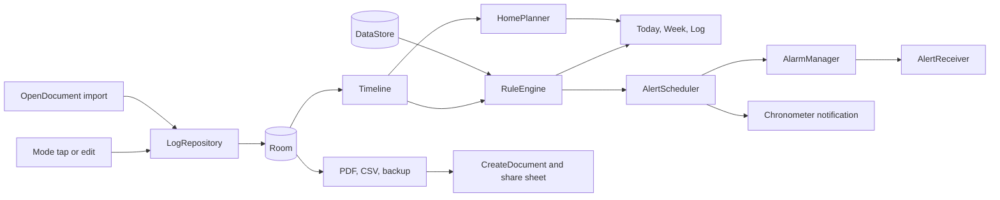

# Dutyclock: the drivers' hours you owe, counted down

A lorry driver in a lay-by at 21:40 does sums on a delivery note: time since the last 45, tonight's rest, what is left of the 90. One wrong answer is a roadside fine, and the paid app that did the sums was abandoned in 2016. Dutyclock is a one-time, offline countdown for EU 561/2006, AETR, GB domestic and Road Transport Working Time rules, with loud alerts, an editable log, a drive-home planner and a printable 28-day record. It is advisory, never a tachograph, and says so.

## 1. Overview

- **Elevator pitch:** a pocket rules engine for EU and UK HGV, coach and newly in-scope 2.5 to 3.5 t van drivers: one tap per mode change, live countdowns for every driving, rest and working-time limit, and compensation tracked to its deadline.
- **Play category:** Auto & Vehicles. **Display name:** Dutyclock. **Play title:** Tachograph Drivers Hours Timer.
- **Tagline:** The drivers' hours you owe, counted down.
- **Positioning line:** EU and UK drivers' hours, counted correctly, for one price, offline.
- **Price:** USD 4.99, INR 299 (hand-set GBP 4.49, EUR 4.99, PLN 19.99, RON 19.99). One SKU, no in-app purchase.

## 2. Problem and why now

The problem is arithmetic under fatigue: a split break counts only as 15 then 30, a reduced weekly rest creates a debt due by the end of the third following week, and RTD working time runs on top.

The US half is cut: the refutation (2026-09-26) found US drivers already get free countdowns from mandated ELD apps such as Motive Driver (1M+, 4.5 from about 35K ratings, https://play.google.com/store/apps/details?id=com.keeptruckin.android). EU and UK paid demand is proven:

- **TruckerTimer** (USD 5.99, 10,000+, 942 ratings on the GB listing, last updated 2016-01-17, https://play.google.com/store/apps/details?id=com.spottydog.tt) sold this job and is abandoned. Reviewers "loved this app for over 5 years", report that 15 plus 30 splits no longer reset the clock, and ask for a printable 28-day report.
- **TachoGuard** (Ztap, USD 5.49, 10,000+, 322 ratings at 3.4 to 3.8, updated 2026-08-19, in the "tachograph" results at https://play.google.com/store/search?q=tachograph&c=apps&gl=GB) is the live paid proof, about 30 paid downloads a month by AppBrain's estimate. Reviews: break starts cannot be edited, battery drain, failing GPS auto-switching.
- Freemium helpers anger users: Tachograph 2.0 paywalls working time ("does not track WTD... makes the app useless"), Tachogram (100K+, 3.5) charges GBP 16, TachoMobile2 locks "basic functions".
- The strongest free rival, **Drivers' Hours: HGV & Van** by witty apps (free with ads, 50+, unrated, updated 2026-08-02, https://play.google.com/store/apps/details?id=com.wittyapps.driverhours), gives away most countdowns: 561/2006 and WTD timers, split breaks, 56, 90 and rest deadlines.

**Why a buyer pays upfront anyway.** Not for countdowns alone. The refuter's check of witty apps lists no editable log, compensation ledger, planner, 28-day record or 48-hour average, and it shows ads and no rating; Dutyclock sells those, each gap confirmed on the installed app before launch. TachoGuard cannot edit breaks and drains the battery; subscriptions recur; a tachograph shows driving left, not a drive home.

**Why now.** From 1 July 2026, 2.5 to 3.5 t vans on international hire-or-reward work fall under 561/2006 (https://eur-lex.europa.eu/eli/reg/2020/1054/oj), so van drivers count hours for the first time. The judge found about 10 to 12 apps for "tachograph" in GB and PL, both paid apps on page one, and "drivers hours" in GB nearly empty. Volume is inferred from result depth, not a keyword tool.

## 3. Target audience and personas

- **Gemma Riley, 36, agency class 1 driver, Doncaster.** Nights out; dropped TruckerTimer over the split-break bug. Types "drivers hours". Pays at screenshots two and three, the split reset and the 28-day PDF: she paid for this job once already.
- **Marek Wójcik, 44, international HGV driver, Poznań.** Curtain-sider runs to Germany, two reduced weekly rests a month. Types "tachograf" in the translated Polish storefront. Pays at the compensation screenshot, "Owed 21 h, attach to a rest by the end of Sunday 25 October", the number he keeps on paper.
- **Andrei Popescu, 29, van courier, Coventry.** 3.5 t van on UK to EU runs, in scope since July 2026. Types "tachograph van". Pays when the planner says, from his own log, that Dover to Coventry fits tonight only with a 45 on the way.

## 4. Core concept deep-dive

**The log is a timeline of mode changes; everything else is derived.** Each tap on a tachograph mode (Driving, Other work, Availability, Break or rest) writes one entry, a start instant and a mode, lasting until the next. The `:core` engine replays the log on every change, so any edit recalculates everything. Rests are classified by length: 15 minutes can be part of a break, 9 hours is a daily rest, 24 a weekly rest.

**Rule sets.** EU 561/2006; AETR (same limits, minus the 2020 Mobility Package articles); Van 2.5 to 3.5 t (the EU set); GB domestic goods (10 h driving, 11 h duty on a day with driving, the day being the 24 hours from the start of duty per GOV.UK section 2). RTD runs with the EU sets: 6 hours of work at most without a break, 30 minutes for 6 to 9 hours and 45 over 9 in 15-minute pieces, 60 hours a week, and at most 48 hours times the weeks in the default fixed reference period, which starts at 00:00 on the Monday on or after 1 April, 1 August or 1 December and so runs 17 or 18 weeks (816 or 864 h; DfT RTD guidance 3.4 and 3.6). Leave is credited at 8 hours a day and 48 hours for a whole Monday to Sunday week (DfT RTD guidance 3.5); the row names its period, since agreements and other countries differ. Weeks are fixed Monday to Sunday in UTC, as the tachograph records; display is local.

**Conservative by construction.** No optional derogation lengthens a countdown (no Article 12 extension, ferry interruption, consecutive reduced weekly rests abroad or coach 12-day rule). The 10-hour day and reduced rests are choices ("Use a 10-hour day: 2 of 2 left"), never assumed. A week mixing EU and GB domestic days counts all driving toward the EU 56 and 90 (GOV.UK section 3 treats GB driving as other work under the EU rules, so this can overcount, never undercount). Compensation is counted paid only when one rest holds it on top of a full 11-hour daily rest or 45-hour weekly rest, stricter than the legal minimum of attaching it to a rest of 9 hours, so a reduced daily rest is never spent silently.

**The one memorable thing:** the Day Disc, the analogue tachograph chart redrawn as a live instrument (section 7). **It refuses** GPS, motion detection, foreground services, card reading, US rules, compliance claims and any tap while driving.

## 5. Complete feature set

**v1.0:**
1. Four rule sets (EU, AETR, van, GB domestic goods), chosen at first run and changeable per day.
2. One-tap mode bar with 5-second undo.
3. EU countdowns: break (45, or 15 then 30), daily driving (9 h, 10 h twice a week), latest daily rest start (11, reduced 9 three times, split 3 plus 9), latest weekly rest start, weekly rest (45, reduced 24, never two reduced in a row), 56-hour week, 90-hour fortnight.
4. Compensation ledger: hours owed and the third-week deadline.
5. RTD: 6-hour break countdown, 30 or 45 minutes, 60-hour week, 48-hour average over the fixed 17-week period, leave credited.
6. GB domestic goods counters: 10 h driving, 11 h duty.
7. The Day Disc and a limits list ordered by urgency.
8. Chronometer countdown notification, no foreground service.
9. Exact-alarm lead and at-limit alerts with inexact fallback.
10. Editable log, break starts included; edits marked.
11. Catch-up sheet for a week already under way.
12. "Can I make it home" planner.
13. 28-day PDF personal record, CSV, JSON backup and import.
14. Two-pane tablet layouts, light and dark themes.

**v1.x:** GB domestic passenger rules, RTD 26-week or rolling periods, multi-manning, ferry interruption, coach 12-day derogation, RTD night work, reviewed in-app translations, exact mixed weeks. **v2:** a Wear OS tile.

**Cut (not built, not listed):** US and Canadian rules; GPS, motion detection, location, foreground services; card reading; the widget; USE_EXACT_ALARM.

## 6. Screen-by-screen UX

**Navigation.** Bottom bar: Today, Week, Log, Plan; Records and Settings as top-bar icons; a NavigationRail at 600dp.

- **First run (one screen):** four rule-set rows with one-line scopes, the checkbox "I understand this is not a tachograph", "Start counting". Today then offers "Bring your week in".
- **Today:** rule-set chip, the Day Disc, the limits list (a row opens the rule and its numbers; the daily driving row offers "Use a 10-hour day", the daily rest row "Take a reduced rest"), and the mode bar pinned at the bottom: four 72dp pictogram buttons, current mode filled. Driving mode adds "Change modes only when stopped."
- **Week:** a row per day (strip, driving, 10-hour and reduced-rest markers; its menu marks annual or sick leave), then 56, 90, weekly rest, compensation, RTD 60 and the 48 average.
- **Log:** day picker and entries; an editor sheet with mode, start, "Split here", delete and "Save entry"; a button to add.
- **Plan:** "Driving left to get home" and "Leaving at"; a timeline with arrival, or the blocking rule and the fix.
- **Records:** PDF (with a `PdfRenderer` first-page preview), CSV, backup export and import.
- **Settings:** rule set, alerts, exact-alarm and notification status, the current RTD period's dates, PDF name and registration, theme, opt-in counts, privacy, licences.

**Flow 1, first drive.** Pick "EU 561/2006", tick, "Start counting", tap Other work, then Driving: the arc starts and the notification counts down from 4:30:00. At 4:15: "Break due in 15 minutes."

**Flow 2, the split break.** After 2 h 10 driving Gemma taps Break or rest at 08:40; at 08:55 the break row reads "15 of 45 taken. Take 30 more before 4:30 of driving." She drives from 08:56, stops at 11:05, and at 11:35 the clock resets: "Split break complete." Later she moves the 08:40 tap to 08:35 and every counter follows.

**Flow 3, can I make it home.** At Dover at 17:20 Andrei enters 3 h 40. From his log (2 h 50 since his break, 4 h 35 today, rest by 23:10) the planner returns: drive 1:40, break 45, drive 2:00, arrive 21:45. Had it failed: "You run out of daily driving 25 minutes short. A 10-hour day would cover it: 1 of 2 left."

## 7. Design system

**Design read:** Reading this as: a professional hours instrument for EU and UK lorry, coach and van drivers, with a cab-dashboard and roadside hi-vis language (the analogue tachograph chart, reflective sign white, wet tarmac), leaning toward IBM Plex Sans Condensed plus Red Hat Text on a **hi-vis chartreuse and wet tarmac** palette.

**Palette family: hi-vis chartreuse and wet tarmac.** The loading-bay vest and the road. Light mode carries the brand; dark mode is lifted blue slate, not near-black, and the accent is a flat fill, never a glow.

**Dials.** Variance 3, an instrument is predictable. Motion 2, nothing moves unless state changed. Density 6, many counters read at arm's length.

| token | role | light | dark |
|---|---|---|---|
| Kerb | background | #ECEFEA | #1F272B |
| Signboard | surfaces, dark disc plate | #F8F9F5 | #2A3439 |
| Tarmac | text, light disc plate, onAccent | #1D2529 | #E8ECE6 |
| Slate | secondary text, dividers | #55616A | #A3AEB4 |
| HiVis | the one accent: live arc, current mode, primary buttons | #B9D839 | #B9D839 |
| Stop | error role only: breach, passed deadline | #B3261E | #EE8A7F |

HiVis is HSL 72 at 67 percent saturation, identical everywhere and in the icon's hue family. Contrast: Tarmac on Kerb 13.4:1, Slate 5.5:1, Tarmac on HiVis 9.6:1, HiVis on dark Kerb 9.4:1, Stop 5.6:1 and 6.2:1. HiVis on light Kerb is 1.4:1, so in light mode it is only a fill under Tarmac or a mark on the Tarmac plate; dark onPrimary is #1D2529. A breach shows "Over" and an icon, never colour alone.

**Type.** IBM Plex Sans Condensed SemiBold 600 and Bold 700 for numerals, headings and buttons (fits "10:45:12" at 56sp, `tnum`); Red Hat Text Regular 400 and Medium 500 for body. Both SIL Open Font Licence 1.1, TTFs in `res/font/`, licences in `docs/`. Scale 56, 22, 20, 16, 14sp; sentence case.

**Radius scale.** 4dp chips and fields, 8dp buttons and groups, 16dp sheet tops. Cards only for the Plan result and catch-up prompt; lists use dividers. **Icons:** Material Icons Outlined for chrome (`material-icons-extended`, added to the app dependencies), plus four vector tachograph pictograms (steering wheel, crossed hammers, availability square, bed), 24dp grid, 2dp stroke.

**The Day Disc (the one memorable thing).** 280dp (360dp in the tablet pane), plate Tarmac in light and Signboard in dark, hour ticks labelled 00, 06, 12, 18, midnight on top. Past segments are bands from the rim inward: Driving 28dp, Other work 18dp, Availability 10dp, rest none. Ticks, bands and numerals use the plate ink, Kerb on the light plate (13.4:1) and Tarmac #E8ECE6 on the dark (10.7:1); the current segment is HiVis (9.6:1, 7.9:1), with a 2dp hand at now and the most urgent counter at 56sp in the centre. All the boldness is spent here.

**Motion.** One first-run moment: the hand settles from midnight to now (400ms). Mode change crossfades the numerals (150ms). No loops or shimmer. Everything reads `LocalReducedMotion` and snaps.

**States** (empty; error; success; loading is a content-shaped skeleton). Log-backed screens share the error "Your log could not be read. Restore a backup from Records." Today: "Tap the mode you are in now"; disc outline; "Driving started" with Undo. Week: "No driving this week yet"; rows filled. Log: "Nothing logged on Tuesday 6 October" with "Add entry"; "That start overlaps the next entry. Pick an earlier time."; "Entry saved". Plan: "Enter the driving left to get home"; "Log today's driving first"; the timeline, or the blocked result in Stop. Records: "Log a day to export a record"; "That file is not a Dutyclock backup."; "PDF exported", "Backup imported: 214 entries". Settings: "Alerts may arrive a few minutes late" with "Allow exact alerts"; "Exact alerts allowed".

**Access and large screens.** WCAG AA, 44dp targets, described icons, text to 200 percent. At 600dp Today splits disc left, limits right; state survives rotation.

**Screenshots (six, 9:16, a seeded Gemma week, five light and one dark):** Today "Break due in 0:52"; split break complete; Records with the PDF preview; Week with compensation; Plan "Arrive 21:45"; Today at night.

**Icon.** Ground chartreuse #C6E62A to #9CCB14 (hue 70 to 76, clear of Portwarden and Snarewall). Mark: a three-spoke Tarmac steering wheel whose upper-right rim quarter is a solid pie wedge, the time left. Feature graphic: ground, mark, "Dutyclock" in Plex Sans Condensed Bold, "Drivers' hours countdowns for EU and UK rules".

## 8. Native architecture

**Generator flags line:**
`new-native-app.sh --name "Dutyclock" --pkg com.mohdshayan.dutyclock --perms "POST_NOTIFICATIONS,SCHEDULE_EXACT_ALARM,RECEIVE_BOOT_COMPLETED,VIBRATE" --room --orient unspecified --bg "#ECEFEA" --bg-dark "#1F272B"`
(with `--dir DEVPROJECTS/dutyclock`). No `--glance` (widget cut), `--work`, `--camerax` or `--media3`.

**Modules.** Built as one `:app` module with a `core` package (pure Kotlin with `java.time`, no Android imports), so the rules engine is tested on the JVM and `build.sh`, which runs and counts only `:app:testDebugUnitTest`, sees every golden test. The original two-module plan follows for reference. Add plugin alias `kotlin-jvm = { id = "org.jetbrains.kotlin.jvm", version.ref = "kotlin" }`, `apply false` at the root; `:core` (in `settings.gradle.kts`) applies `kotlin-jvm` and `kotlin-serialization`, JVM 17, with `kotlinx-serialization-json` and `junit`; `:app` depends on `project(":core")`.

**Package map.** `:core`: `model`, `time` (FixedWeek UTC), `timeline` (merge seed and entries, classify rests), `rules/eu`, `rules/gb`, `rules/rtd`, `engine` (RuleEngine returns Counter and Finding lists), `plan` (HomePlanner), `pdf` (PdfWriter copied from `kickset/core/src/main/kotlin/com/mohdshayan/kickset/core/pdf/PdfWriter.kt`, repackaged; RecordPdf, which folds names to WinAnsi first with `Normalizer` NFD and ł to l, since PdfWriter prints other letters as "?"), `backup`. `:app`: `data/db`, `data/prefs`, `data/repo/LogRepository`, `alerts` (AlertScheduler, AlertReceiver, BootReceiver, TimeChangeReceiver, ExactAlarmStateReceiver, CountdownNotifier), one `ui/<screen>` per screen, `ui/components` (DayDisc, ModeBar, LimitRow, TachoIcons).

**ViewModels.** One per screen, `stateIn(WhileSubscribed(5_000))`, evaluated on `Dispatchers.Default`; LogRepository reschedules alerts after every write.

**Catalog aliases.** `androidx-core-ktx`, `androidx-core-splashscreen`, `androidx-lifecycle-runtime-ktx`, `androidx-lifecycle-runtime-compose`, `androidx-lifecycle-viewmodel-compose`, `androidx-activity-compose`, `androidx-compose-bom`, `androidx-ui`, `androidx-ui-graphics`, `androidx-ui-tooling`, `androidx-ui-tooling-preview`, `androidx-material3`, `androidx-material-icons-extended`, `androidx-navigation-compose`, `androidx-room-runtime`, `androidx-room-ktx`, `androidx-room-compiler`, `androidx-datastore-preferences`, `kotlinx-coroutines-android`, `kotlinx-coroutines-test`, `kotlinx-serialization-json`, `junit`; plugins `android-application`, `kotlin-android`, `kotlin-compose`, `kotlin-serialization`, `ksp`, `kotlin-jvm`. Added `play-review-ktx = { group = "com.google.android.play", name = "review-ktx", version = "2.0.2" }`, dropped with its prompt if the merged manifest gains any permission.

**Sensors and assets.** No sensors. Four font TTFs (under 1 MB, OFL 1.1). The privacy summary and rule summaries are compiled into the app as text, shown in Settings (Privacy, Licences, Sources) and in each limit's sheet with its working and source, instead of separate `assets/privacy.html` and `assets/rules.html` files; same content, no WebView.

**Manifest permissions, complete:**
- `POST_NOTIFICATIONS`: countdown notification and alerts, asked on Today after "Allow notifications so break alerts can reach you"; without it, countdowns stay in-app.
- `SCHEDULE_EXACT_ALARM`: an alert must fire at the minute a legal limit is reached; granted through `ACTION_REQUEST_SCHEDULE_EXACT_ALARM` after an explanation sheet, then `setExactAndAllowWhileIdle`; while `canScheduleExactAlarms()` is false, `setAndAllowWhileIdle`. `USE_EXACT_ALARM` is never declared.
- `RECEIVE_BOOT_COMPLETED`: re-arms alerts after a restart mid-shift.
- `VIBRATE`: alert vibration for a noisy cab.
No INTERNET, location or foreground service.

**Background work.** AlarmManager only, at most three pending alarms, rescheduled on every write, boot, `MY_PACKAGE_REPLACED`, `TIME_SET`, `TIMEZONE_CHANGED` and the exact-alarm permission change; each at-limit alarm also re-posts the countdown for the next limit. Channel `limit_alerts`: IMPORTANCE_HIGH, `CATEGORY_ALARM`, alarm audio, sound once, vibration; it sounds when Do Not Disturb allows alarms and never overrides DND. Channel `countdown`: silent and ongoing, `setWhen(limitAt)`, `setUsesChronometer(true)`, `setChronometerCountDown(true)`, ticked by the system. No widgets or tiles.



## 9. Data model

**Room, version 1.**
- `ActivityEntry`: `id: Long` PK autogenerate, `startUtc: Long` (epoch ms, unique index), `mode: String` (DRIVE, WORK, AVAILABLE, REST), `ruleSet: String` (EU, AETR, VAN, GB_GOODS), `source: String` (LIVE, EDIT, IMPORT), `note: String?`, `createdAt: Long`, `editedAt: Long?` (non-null marks it edited in the PDF).
- `Seed` (one row, `id: Int` = 1): `seededAtUtc: Long`, `drivingSinceBreakMin: Int`, `dayStartUtc: Long`, `drivingTodayMin: Int`, `thisWeekDrivingMin: Int`, `lastWeekDrivingMin: Int`, `thisWeekWorkMin: Int`, `rtdPeriodWorkMin: Int` (work in the current 17-week period before this week), `tenHourDaysUsed: Int`, `reducedDailyRestsUsed: Int`, `lastWeeklyRestEndUtc: Long?`, `lastWeeklyRestMin: Int?`, `compensationOwedMin: Int`, `compensationDueUtc: Long?`.
- `Absence`: `id: Long` PK, `date: String` (ISO local date, unique), `kind: String` (ANNUAL_LEAVE, SICK), `creditedMin: Int` (480 default; the DfT RTD guidance 3.5 credits 8 hours a day and 48 hours a whole week, so credit is capped at 48 hours per fixed week; golden test from its Example 2).

**DataStore keys.** `onboarding_done`, `disclaimer_ack_version`, `rule_set_default`, `ten_hour_day_date`, `reduced_rest_date`, `alert_lead_min` (15), `alert_sound`, `alert_vibrate`, `alert_break_complete`, `driver_name`, `vehicle_reg`, `theme_mode`, `usage_counts_opt_in` (false), `count_*` counters, `completed_days`, `review_prompted`.

**Export and import.** Backup `dutyclock-backup-YYYY-MM-DD.json`: `{"format":"dutyclock-backup","schema":1,"exportedAt":...,"prefs":{...},"seed":{...},"entries":[...],"absences":[...]}`; import validates format and schema, then replaces in one transaction after confirmation. CSV: `start_local,start_utc,mode,duration_min,rule_set,edited`, UTF-8 with header. PDF: A4 portrait, header "Personal record. Not a tachograph record." with driver, vehicle and dates; a strip and totals per day, weekly and fortnightly sums, RTD weeks, edited entries asterisked. All through `CreateDocument` and the share sheet.

## 10. Pricing and countries

USD 4.99 and INR 299, the "professional or privacy tool" rung of the batch ladder ($4.99 / Rs 249; market-map-v2: goal-driven buyers are less price-elastic). That rung's INR is 249; the wave decision fixed 299, kept here because India has no search market for EU rules and market-map-v2 sets INR 199 to 349 for professional tools. Hand-set GBP 4.49, EUR 4.99, PLN 19.99, RON 19.99, other countries by hand. No launch discount and no sale. Refunds: Play's 48-hour window.

Why this niche pays: TachoGuard holds USD 5.49 after 13 years, TruckerTimer sold 10,000+ at USD 5.99, Driver Card Reader Pro (50K+, 4.8) sells at GBP 6.99 to the same buyer, and Tachogram asks GBP 16. A missed-break fine costs far more, and USD 4.99 sits under both paid rivals.

## 11. Play Store listing

**Title (30 of 30):** `Tachograph Drivers Hours Timer`

**Short description (79 of 80):** `HGV and van drivers hours, breaks and WTD. One-time, offline, no ads or account`

**Full description (2,378 of 4,000):**

```
Drivers' hours countdowns for EU 561/2006, AETR and GB domestic rules: break due, daily driving, rest deadlines, the 56-hour week and the 90-hour fortnight.
Split breaks count properly: 15 minutes then 30 minutes resets your 4.5-hour clock, and every break start time can be edited afterwards.
Working time too: RTD breaks after 6 and 9 hours, the 60-hour week and your 48-hour average, with a printable 28-day record.

Tap the mode you are in, the same four your tachograph uses: driving, other work, availability, break or rest. Every limit counts down on one screen, and the next one to run out counts down in a notification, and an alert sounds before a break is due or a rest must start.

What it tracks
- 4.5 hours driving, then 45 minutes or a 15 plus 30 split
- 9-hour days, and which of your two 10-hour days are left
- Daily rest: 11 hours, reduced 9 or split 3 plus 9, with the latest start time
- Weekly rest: 45 hours or reduced 24, plus the compensation you owe and its deadline
- 56 hours in the week, 90 across two weeks
- GB domestic goods limits
- Van mode for 2.5 to 3.5 tonne vans on international hire or reward work

Can I make it home?
Enter the driving left to get home. Dutyclock lays out the soonest order of driving, breaks and rest the rules allow, from your own log, or shows where it runs out.

Missed a tap? Move, split or delete any entry and the countdowns recalculate. Started mid-week? Enter your week so far in one sheet.

Export a 28-day PDF with a strip and totals for each day, weekly and fortnightly sums and working time, plus CSV and a backup you can restore on a new phone.

Alerts use exact alarms when you allow them, with a loud alarm sound and vibration, and fall back to standard alerts if you do not. Nothing needs a tap while you drive.

One-time purchase. No ads, no subscription, no account. Works fully offline.

No location, no GPS, no sign-in, no tracking, no battery-draining background service. Nothing leaves your phone.

Dutyclock is an advisory planner for your own use. It is not a tachograph, not an ELD and not a legal record, and it does not replace your tachograph or operator records. Check it only when parked. Not affiliated with DVSA, the European Commission or any government body.

English interface. Ferry and train crossings, multi-manning, GB domestic passenger rules, the coach 12-day derogation and US or Canadian rules are not calculated.
```

**Translated listings** (store text only; the app is English and the listing says so), each checked by a native speaker: PL "tachograf", "czas pracy kierowcy"; RO "tahograf", "timp de condus"; LT "tachografas", "vairavimo laikas"; DE "Lenk- und Ruhezeiten", "Tachograph".

**Keywords:** tachograph, drivers hours, HGV drivers hours, working time directive, WTD, split break, 90 hour fortnight, reduced weekly rest, compensation rest, van tachograph, 561/2006, AETR, coach drivers hours.

**Screenshot captions:** 1 "Every limit on one dial". 2 "15 then 30 resets your 4.5 hours". 3 "A 28-day record you can print". 4 "Compensation owed, with its deadline". 5 "Can I make it home?". 6 "Built for the cab at night".

**Feature graphic:** as in section 7; no price, badge or tachograph manufacturer imagery. **Category** Auto & Vehicles. **Content rating** Everyone. **Target age** 18 and over. Paid, no ads, no in-app purchases, works offline.

## 12. Policy and data safety

Data safety: no data collected or shared; backups are user-initiated files. The privacy policy, generated from the four permissions, is hosted before the Console form and bundled in-app. `SCHEDULE_EXACT_ALARM` needs no Console declaration and `USE_EXACT_ALARM` is absent. No health or financial declarations; Government apps answers "not affiliated" and no official emblem appears. Driver distraction: no interaction needed while driving, alerts end on their own, no Android Auto surface. The listing never claims compliance, legal validity, DVSA approval or "avoid fines", and never calls the PDF a tachograph printout.

## 13. Organic growth

Play search is the distribution: "Tachograph" and "Drivers Hours" in the title carry the two thin result pages the judge measured; the short description adds "HGV", "van" and "WTD"; the opening lines carry "split break", "90-hour fortnight" and "working time". Translated listings target PL, RO, LT and DE. The in-app review prompt comes after the third completed working day (a daily rest after a day with driving) or right after a PDF export once three days exist; never on first launch, never in Driving mode. No paid acquisition, fake reviews or competitor names; one honest launch post in driver forums.

## 14. KPIs

Local-only, opt-in counts (off by default, never sent anywhere): mode taps, planner runs, exports, completed days. The three numbers that say it works: (1) refund rate under 10 percent in the first 48 hours, meaning the first-run promise holds; (2) a rating of 4.3 or better with reviews naming split breaks or the PDF; (3) paid installs at or above TachoGuard's roughly 30 a month by month three across GB and PL. If opt-in mode taps per working day fall, one-tap switching is failing.

## 15. Risks and mitigations

- **Rules correctness, the hardest subsystem.** A wrong countdown can cost a fine. Every rule is a pure `:core` function with golden tests from worked examples in GOV.UK guidance (https://www.gov.uk/drivers-hours/eu-rules, now titled "Assimilated rules", https://www.gov.uk/drivers-hours/gb-domestic-rules), DVSA's goods vehicle guide formerly published as GV262 (https://www.gov.uk/guidance/drivers-hours-goods-vehicles) and the DfT Road Transport (Working Time) guidance, each naming its source; no optional derogations; every counter's sheet shows its working.
- **The refund window.** A mid-week installer sees wrong counters; the catch-up card on first Today takes under a minute.
- **Free incumbent and TachoGuard.** Witty apps gives most countdowns away; the listing sells edits, compensation, planner, PDF, 48-hour average and no ads.
- **Exact alarms denied** by default on Android 14 and later: inexact fallback, the chronometer notification and a Settings banner.
- **Policy.** The advisory statement at first run and in the listing; no compliance claims.
- **Small market.** The van scope change widens it; a yearly update keeps it ranked.
- **UTC weeks.** Summer time shifts week boundaries from local midnight; DST golden tests.

## 16. Competitive landscape

- **TachoGuard** (USD 5.49, 10,000+, 3.4 to 3.8, updated 2026-08-19): Dutyclock edits breaks, skips GPS and plans the way home.
- **TruckerTimer** (USD 5.99, 10,000+, last update 2016-01-17): abandoned with a split-break bug; Dutyclock fixes it and adds the requested 28-day PDF.
- **Drivers' Hours: HGV & Van, witty apps** (free with ads, 50+, unrated, updated 2026-08-02): most countdowns free; Dutyclock adds edits, compensation, planner, PDF and RTD average, without ads.
- **Tachograph 2.0, Tachogram (100K+, 3.5, GBP 16), TachoMobile2:** paywalled basics; Dutyclock is one price.
- **HGV Time Pilot (100+), MyHours HGV (1,000+), WTD for HGV (100+):** free single-purpose entrants; Dutyclock covers every rule set in one log.
- **HGV Companion UK** (USD 6.49, 5+): a toolkit with an hours page; Dutyclock is the dedicated tool. Motive and other ELD apps are North American only.

## 17. Development plan

Six weeks of solo work; GB domestic passenger and RTD 26-week or rolling periods moved to v1.x to fit. **Week 1:** `:core` model, FixedWeek, Timeline and rest classification; EU break, daily driving, daily rest (regular, reduced, split), 56 and 90; golden tests. **Week 2:** weekly rest, reduced weekly rest and compensation, AETR, van, GB goods, RTD, seed merge; golden tests. **Week 3:** HomePlanner and RecordPdf in `:core` with tests; generate the project; Room, prefs, onboarding, catch-up. **Week 4:** Today with disc and mode bar, countdown notification, alerts, receivers, exact-alarm grant and fallback. **Week 5:** Log and editor, Week, Plan, Records (PDF, CSV, backup), Settings. **Week 6:** states, accessibility, two-pane, dark mode, icon, screenshots, listing and translations, privacy policy, preflight, smoke.

**Cut if behind, in order:** two-pane beyond Today, CSV export (listing edited to match), the alert sound choice; never split breaks, compensation, edits, RTD, the PDF or the planner.

**JVM tests (golden, each citing its source):** 4:30 then 45 resets; 15 then 30 resets, 30 then 15 and other work do not; third 10 h day refused; daily rest deadline at start plus 24 h minus 11 or 9 h; split 3 plus 9 accepted, 9 plus 3 rejected; fourth reduced daily rest flagged; weekly rest latest start after six 24-hour periods; two consecutive reduced weekly rests flagged; compensation owed and discharged only when attached to 9 h or more; 56 h and 90 h across a UTC week boundary and a DST change; a weekly rest spanning two weeks counted once; RTD 6 h, 30 vs 45 minutes, 60 h, 17-week period anchors and the 816 h total with leave; GB goods 11 h duty; mixed week overcounts; planner fits, blocks, offers the 10-hour day; backup round trip; PDF has "Not a tachograph record", 28 strips, and "Łukasz Kowalski" printed as "Lukasz Kowalski".

**Emulator smoke:** first run under 60 seconds; modes update disc and notification; split reset; edit a break; deny then grant exact alarms; a test alert fires; relaunch and reboot keep log and alerts; rotation, dark mode, backup round trip, PDF, airplane mode.

**android-ship preflight:** no INTERNET in the merged manifest; exactly the four permissions; no USE_EXACT_ALARM; target SDK 36; signed `CN=SocialSure Private Limited`; privacy policy live; data safety "no data collected"; listing matches the binary; zero em-dash and en-dash characters.
